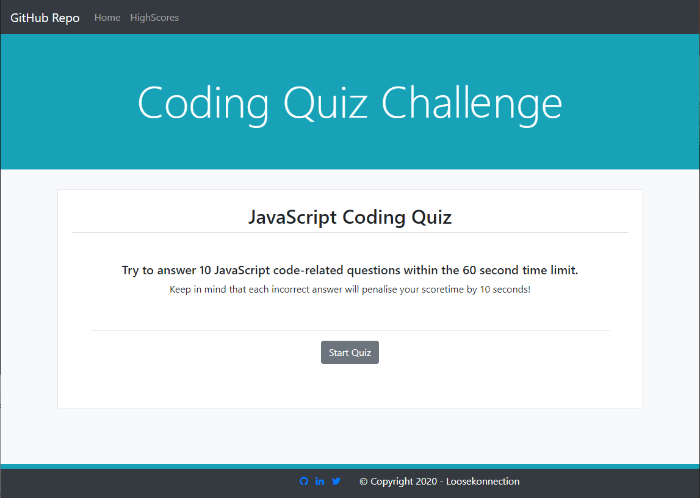
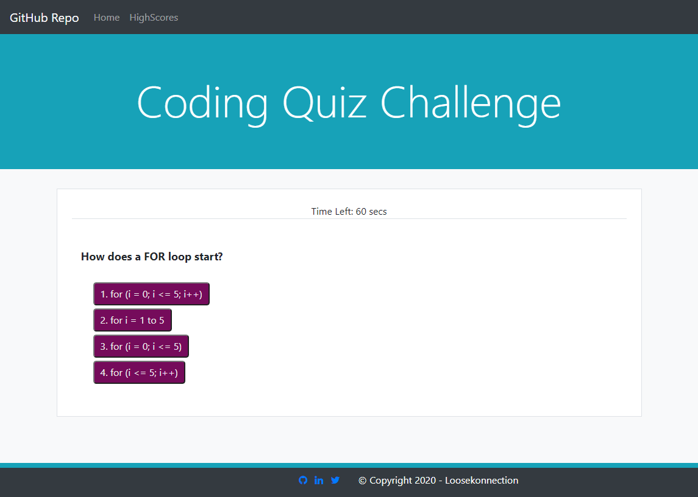
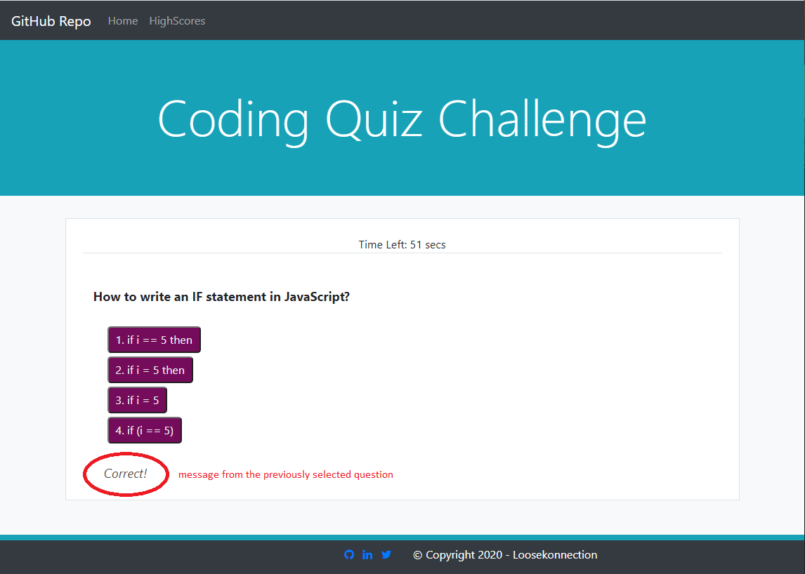
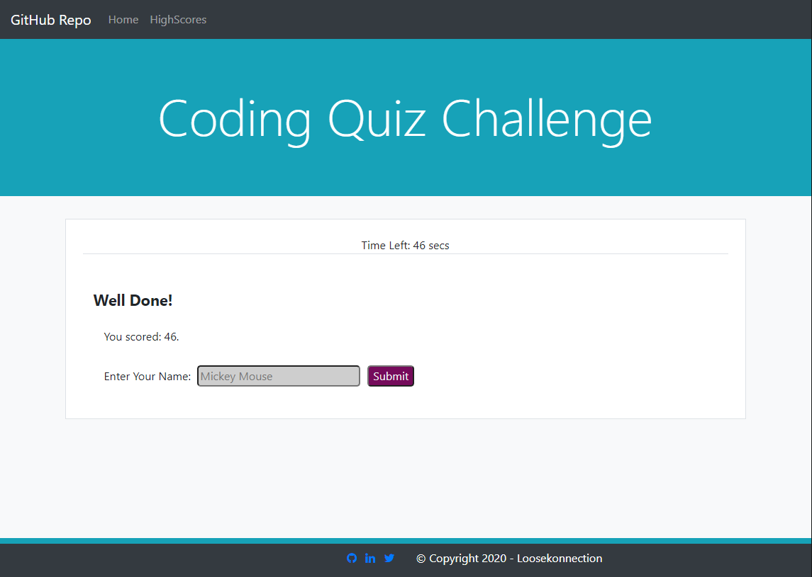
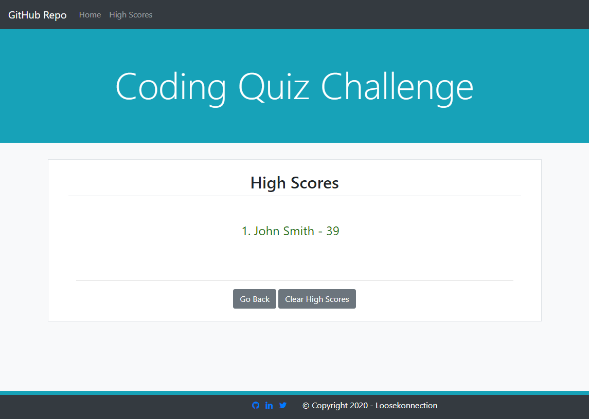

# JavaScript Code Quiz

## Description 

*A summary of what this project is, and why it has been created:*

This project is a quiz that presents JavaScript questions that are randomly picked form a pool of questions. The site is coded using HTML, CSS & jQuery.

 

---

 

## Table of Contents       
   * [Installation](#installation)
   * [Usage](#usage)
   * [Contributing](#contributing)    
   * [Tests](#tests)    
   * [License](#license)
   * [Questions](#questions)
---

 

## Installation

*How to install this project:*

You can clone this repository to a local directory or fork the repository and take a copy.

 
---

 

## Usage 

*How to use this project:*

The site can either be used via the published link on my GitHub account: [JSCodeQuiz](https://loosekonnection.github.io/JSCodeQuiz), or once the repo is copied locally it can be used from running the index.html file in a web browser of your choice.          Upon clicking the 'Start Quiz' button the quiz randomly picks 10 questions to answer from a pool of questions.          You will be advised if your answer selection was Correct! or Wrong!          For every incorrect answer 10 seconds is taken from the countdown timer. If the timer ends before the player can complete all questions, a Game Over! message is displayed and a retry button is displayed.     If a player succesfully completes all 10 questions within the 60 seconds, The players score is the remaining time left over after completing all 10 questions. The player is then prompted to input their initials/name.          The player's initials and score are then added to the Highscore table.     

---

 

## Contributing

*If you like what you see and you would like to contribute, here's how you can:*

Please use the below contact details in the questions section to reach out with a contribution request. I will then give you access so you can work onthe project. There are many areas that could be improved upon and any additional ideas and critique are welcomed.

 
---

 

## Tests

*Tests that have been run, and how to run them:*

The only tests performed on this project are the manual ones from within a web browser, trial and error, if it works great if not work towards resolving why.

---

 

## License

*The following license has been applied to this project:*

MIT License - for more detail [Visit Site](https://opensource.org/licenses/MIT)

---

 

## Questions?

*For any questions regarding this project, please use either of the below contact details:*

GitHub: [@loosekonnection](https://github.com/loosekonnection)

Email: loosekonnection@gmail.com

---

 

## Copyright

© 2021 - Loosekonnection - Getting there, but have a long road ahead.

